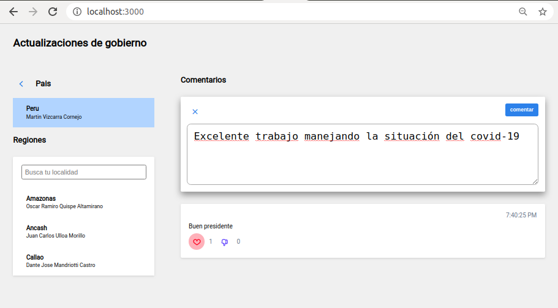

# Peruvian Authorities Book

This is a React + Django application where we use the data from [Infogob](https://infogob.jne.gob.pe/) to be able to find, make comments and vote, on major authorities of Peruvian regions.



## Dependencies

- make
- docker-compose

## Setup

- Create a .env file copying the content of .env_example
- The MAX_ITER variable defines the maximum children of a locality that can be scrapped.

```bash
make restart-db
```

## How to use

```bash
make up
```

The scrapper will begin working on the first server run, so it can take some time while the data is loading.
